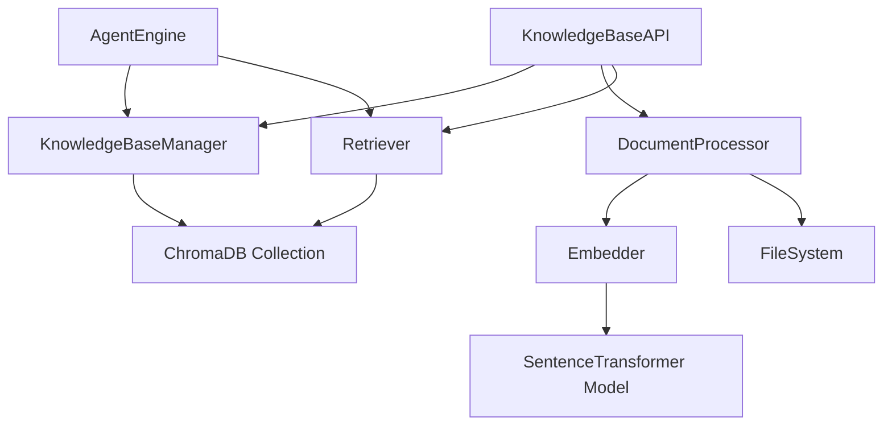

# 系统架构设计文档

## 知识库（RAG）管理系统及动态挂载机制

| 文档版本 | v1.0 |
|----------|------|
| 创建日期 | 2026-03-16 |
| 作者 | AC130 Team Lead |
| 状态 | 草案 |

---

## 1. 架构概述

### 1.1 系统定位

知识库（RAG）系统作为 Agent Builder 的**新增子系统**，提供文档语义检索能力，通过动态挂载机制为智能体增强私有知识问答能力。

### 1.2 架构原则

| 原则 | 说明 |
|------|------|
| **松耦合** | 知识库系统独立运行，与现有系统最小化依赖 |
| **可插拔** | 智能体可选挂载知识库，不影响非知识库场景 |
| **本地优先** | 所有组件支持离线运行，无外部依赖 |
| **渐进增强** | MVP 先实现基础功能，后续扩展高级特性 |

### 1.3 系统边界

```
┌─────────────────────────────────────────────────────────────────┐
│                        Agent Builder                             │
│  ┌─────────────┐  ┌─────────────┐  ┌─────────────┐             │
│  │  智能体系统  │  │  MCP 服务   │  │  Skill 系统  │             │
│  └─────────────┘  └─────────────┘  └─────────────┘             │
│                                                                  │
│  ┌───────────────────────────────────────────────────────────┐  │
│  │                    知识库系统 (新增)                       │  │
│  │  ┌─────────┐ ┌─────────┐ ┌─────────┐ ┌─────────┐         │  │
│  │  │ 知识库   │ │ 文档处理 │ │ 向量化  │ │ 向量检索 │         │  │
│  │  │ 管理器   │ │ 器      │ │ 器      │ │ 器      │         │  │
│  │  └─────────┘ └─────────┘ └─────────┘ └─────────┘         │  │
│  └───────────────────────────────────────────────────────────┘  │
└─────────────────────────────────────────────────────────────────┘
```

---

## 2. 架构分层

### 2.1 四层架构

```
┌─────────────────────────────────────────────────────────────────┐
│                      表现层 (Presentation)                       │
│  • KnowledgeBasePage (知识库管理页面)                           │
│  • KnowledgeBaseDetail (知识库详情)                             │
│  • KnowledgeBaseSelector (智能体配置选择器)                     │
└─────────────────────────────────────────────────────────────────┘
                              ▼
┌─────────────────────────────────────────────────────────────────┐
│                       API 层 (Interface)                         │
│  • GET /api/knowledge-bases                                     │
│  • POST /api/knowledge-bases/{id}/documents                    │
│  • POST /api/knowledge-bases/{id}/search                       │
└─────────────────────────────────────────────────────────────────┘
                              ▼
┌─────────────────────────────────────────────────────────────────┐
│                      业务层 (Business Logic)                     │
│  • KnowledgeBaseManager (知识库生命周期管理)                    │
│  • DocumentProcessor (文档解析与分块)                           │
│  • Embedder (文本向量化)                                        │
│  • Retriever (语义检索)                                         │
└─────────────────────────────────────────────────────────────────┘
                              ▼
┌─────────────────────────────────────────────────────────────────┐
│                      数据层 (Data Layer)                         │
│  • 文件系统 (原始文档存储)                                       │
│  • ChromaDB (向量索引)                                          │
│  • JSON (元数据存储)                                            │
└─────────────────────────────────────────────────────────────────┘
```

### 2.2 模块依赖关系



---

## 3. 核心组件设计

### 3.1 KnowledgeBaseManager

**职责**：知识库生命周期管理

```python
class KnowledgeBaseManager:
    """知识库管理器

    负责：
    - 知识库的 CRUD 操作
    - 知识库元数据持久化
    - 向量集合管理
    """

    def __init__(self, data_dir: Path):
        self.data_dir = data_dir
        self.kb_dir = data_dir / "knowledge_bases"
        self.kb_dir.mkdir(parents=True, exist_ok=True)
        self.config_file = self.kb_dir / "knowledge_bases.json"

        self._load_configs()

    def _load_configs(self):
        """加载知识库配置"""

    def _save_configs(self):
        """保存知识库配置"""

    def create_kb(
        self,
        name: str,
        description: str = "",
        embedding_model: str = "BAAI/bge-small-zh-v1.5"
    ) -> KnowledgeBase:
        """创建知识库

        Returns:
            KnowledgeBase: 创建的知识库对象
        """

    def delete_kb(self, kb_id: str) -> bool:
        """删除知识库

        删除向量集合、元数据和所有文档
        """

    def list_kb(self) -> List[KnowledgeBase]:
        """列出所有知识库"""

    def get_kb(self, kb_id: str) -> Optional[KnowledgeBase]:
        """获取知识库"""

    def get_collection(self, kb_id: str) -> chromadb.Collection:
        """获取知识库的向量集合"""
        import chromadb
        client = chromadb.PersistentClient(
            path=str(self.kb_dir / kb_id / "vectordb")
        )
        return client.get_or_create_collection(
            name="documents",
            metadata={"hnsw:space": "cosine"}
        )
```

### 3.2 DocumentProcessor

**职责**：文档解析与分块

```python
class DocumentProcessor:
    """文档处理器

    负责：
    - 文档格式解析 (PDF/DOCX/TXT/MD)
    - 文本分块
    - 分块元数据生成
    """

    SUPPORTED_FORMATS = {".pdf", ".txt", ".md", ".docx"}

    def __init__(self, chunk_size: int = 500, chunk_overlap: int = 50):
        from langchain_text_splitters import RecursiveCharacterTextSplitter
        self.splitter = RecursiveCharacterTextSplitter(
            chunk_size=chunk_size,
            chunk_overlap=chunk_overlap,
            separators=["\n\n", "\n", "。", "！", "？", "；", "，", " ", ""],
            length_function=len,
        )

    def parse(self, file_path: Path) -> str:
        """解析文档提取文本

        Args:
            file_path: 文档路径

        Returns:
            str: 提取的文本内容

        Raises:
            ValueError: 不支持的文件格式
        """
        suffix = file_path.suffix.lower()

        if suffix == ".pdf":
            return self._parse_pdf(file_path)
        elif suffix == ".docx":
            return self._parse_docx(file_path)
        elif suffix in {".txt", ".md"}:
            return self._parse_text(file_path)
        else:
            raise ValueError(f"不支持的文件格式: {suffix}")

    def _parse_pdf(self, file_path: Path) -> str:
        """解析 PDF 文档"""
        import pypdfium2

        pdf = pypdfium2.PdfDocument(file_path)
        text_parts = []

        for page in pdf:
            text_page = page.get_textpage()
            text = text_page.get_text_range()
            text_parts.append(text)

        return "\n".join(text_parts)

    def _parse_docx(self, file_path: Path) -> str:
        """解析 DOCX 文档"""
        from docx import Document

        doc = Document(file_path)
        paragraphs = [p.text for p in doc.paragraphs]
        return "\n".join(paragraphs)

    def _parse_text(self, file_path: Path) -> str:
        """解析纯文本"""
        return file_path.read_text(encoding="utf-8")

    def chunk(self, text: str, doc_id: str) -> List[Chunk]:
        """文本分块

        Args:
            text: 待分块文本
            doc_id: 文档 ID

        Returns:
            List[Chunk]: 分块列表
        """
        chunks_text = self.splitter.split_text(text)

        chunks = []
        position = 0

        for i, chunk_text in enumerate(chunks_text):
            chunk = Chunk(
                chunk_id=f"{doc_id}_{i}",
                doc_id=doc_id,
                content=chunk_text,
                chunk_index=i,
                start_pos=position,
                end_pos=position + len(chunk_text)
            )
            chunks.append(chunk)
            position += len(chunk_text)

        return chunks

    def process(self, file_path: Path, doc_id: str) -> ProcessedDocument:
        """完整处理流程

        Returns:
            ProcessedDocument: 包含文本和分块的结果
        """
        text = self.parse(file_path)
        chunks = self.chunk(text, doc_id)

        return ProcessedDocument(
            doc_id=doc_id,
            text=text,
            chunks=chunks,
            char_count=len(text),
            chunk_count=len(chunks)
        )
```

### 3.3 Embedder

**职责**：文本向量化

```python
class Embedder:
    """向量化器

    负责：
    - 加载嵌入模型
    - 批量编码文本
    - 编码结果缓存
    """

    def __init__(self, model_name: str = "BAAI/bge-small-zh-v1.5"):
        from sentence_transformers import SentenceTransformer

        self.model_name = model_name
        self.model = None  # 延迟加载
        self._dimension = 512  # bge-small-zh-v1.5 的维度

    def _load_model(self):
        """延迟加载模型"""
        if self.model is None:
            from sentence_transformers import SentenceTransformer
            self.model = SentenceTransformer(self.model_name)

    @property
    def dimension(self) -> int:
        """获取向量维度"""
        return self._dimension

    def encode(self, texts: List[str]) -> List[List[float]]:
        """编码文本为向量

        Args:
            texts: 文本列表

        Returns:
            List[List[float]]: 向量列表
        """
        self._load_model()
        embeddings = self.model.encode(
            texts,
            normalize_embeddings=True,
            show_progress_bar=False
        )
        return embeddings.tolist()

    def encode_single(self, text: str) -> List[float]:
        """编码单个文本"""
        result = self.encode([text])
        return result[0] if result else []
```

### 3.4 Retriever

**职责**：语义检索

```python
class Retriever:
    """向量检索器

    负责：
    - 查询向量化
    - 相似度检索
    - 结果过滤和排序
    """

    def __init__(
        self,
        collection: chromadb.Collection,
        embedder: Embedder
    ):
        self.collection = collection
        self.embedder = embedder

    def search(
        self,
        query: str,
        top_k: int = 3,
        score_threshold: float = 0.6
    ) -> List[RetrievalResult]:
        """检索相关文档片段

        Args:
            query: 查询文本
            top_k: 返回结果数量
            score_threshold: 相似度阈值 (0-1)

        Returns:
            List[RetrievalResult]: 检索结果列表
        """
        # 1. 查询向量化
        query_embedding = self.embedder.encode_single(query)

        # 2. 向量检索
        results = self.collection.query(
            query_embeddings=[query_embedding],
            n_results=top_k * 2  # 多取一些用于过滤
        )

        # 3. 格式化结果
        formatted_results = []
        for i, (doc_id, distance, content) in enumerate(zip(
            results['ids'][0],
            results['distances'][0],
            results['documents'][0]
        )):
            # ChromaDB 返回的是 L2 距离，转换为相似度
            score = 1 / (1 + distance)

            if score >= score_threshold:
                formatted_results.append(RetrievalResult(
                    content=content,
                    doc_id=doc_id,
                    filename=results['metadatas'][0][i].get('filename', 'unknown'),
                    score=score,
                    chunk_index=results['metadatas'][0][i].get('chunk_index', 0)
                ))

            if len(formatted_results) >= top_k:
                break

        return formatted_results
```

---

## 4. 数据架构

### 4.1 目录结构

```
data/
├── knowledge_bases/
│   ├── knowledge_bases.json          # 知识库元数据索引
│   │
│   ├── {kb_id}/                      # 单个知识库目录
│   │   ├── metadata.json             # 知识库配置
│   │   │
│   │   ├── documents/                # 原始文档存储
│   │   │   ├── {doc_id}.pdf
│   │   │   ├── {doc_id}.docx
│   │   │   └── ...
│   │   │
│   │   ├── vectordb/                 # ChromaDB 向量索引
│   │   │   ├── chroma.sqlite3
│   │   │   └── ...
│   │   │
│   │   └── chunks.json               # 文档块元数据（可选）
│   │
│   └── ...
│
├── agent_configs.json                # 智能体配置（含知识库挂载信息）
│
└── ...
```

### 4.2 数据模型

```python
class KnowledgeBase(BaseModel):
    """知识库配置"""
    kb_id: str
    name: str
    description: str = ""
    embedding_model: str = "BAAI/bge-small-zh-v1.5"
    created_at: str
    updated_at: str

    # 统计信息（运行时计算）
    doc_count: int = 0
    chunk_count: int = 0
    total_size: int = 0


class Document(BaseModel):
    """文档元数据"""
    doc_id: str
    kb_id: str
    filename: str
    file_size: int
    file_path: str
    mime_type: str
    chunk_count: int
    status: DocumentStatus  # processing / ready / failed
    uploaded_at: str
    processed_at: Optional[str] = None
    error_message: Optional[str] = None


class DocumentStatus(str, Enum):
    PROCESSING = "processing"
    READY = "ready"
    FAILED = "failed"


class ChunkMetadata(BaseModel):
    """文档块元数据（存储在 ChromaDB metadata 中）"""
    doc_id: str
    chunk_index: int
    filename: str
    chunk_length: int
```

### 4.3 ChromaDB Schema

```python
# Collection: "documents"
# Metadata:
{
    "hnsw:space": "cosine"  # 使用余弦相似度
}

# Document 结构:
{
    "ids": ["doc1_chunk0", "doc1_chunk1", ...],
    "documents": ["文档内容1", "文档内容2", ...],
    "embeddings": [[0.1, 0.2, ...], [0.3, 0.4, ...]],  # 可选，自动生成
    "metadatas": [
        {
            "doc_id": "doc1",
            "chunk_index": 0,
            "filename": "员工手册.pdf",
            "chunk_length": 500
        },
        ...
    ]
}
```

---

## 5. API 设计

### 5.1 RESTful 端点

| 端点 | 方法 | 描述 | 权限 |
|------|------|------|------|
| `/api/knowledge-bases` | GET | 列出所有知识库 | 公开 |
| `/api/knowledge-bases` | POST | 创建知识库 | 公开 |
| `/api/knowledge-bases/{id}` | GET | 获取知识库详情 | 公开 |
| `/api/knowledge-bases/{id}` | DELETE | 删除知识库 | 公开 |
| `/api/knowledge-bases/{id}/documents` | GET | 列出文档 | 公开 |
| `/api/knowledge-bases/{id}/documents` | POST | 上传文档 | 公开 |
| `/api/knowledge-bases/{id}/documents/{doc_id}` | DELETE | 删除文档 | 公开 |
| `/api/knowledge-bases/{id}/search` | POST | 检索测试 | 公开 |
| `/api/knowledge-bases/{id}/stats` | GET | 统计信息 | 公开 |

### 5.2 API 详细定义

#### 创建知识库

```http
POST /api/knowledge-bases
Content-Type: application/json

{
  "name": "公司制度库",
  "description": "包含员工手册、报销制度等文档",
  "embedding_model": "BAAI/bge-small-zh-v1.5"
}

Response 201:
{
  "kb_id": "kb_abc123",
  "name": "公司制度库",
  "description": "包含员工手册、报销制度等文档",
  "embedding_model": "BAAI/bge-small-zh-v1.5",
  "created_at": "2026-03-16T10:00:00",
  "doc_count": 0,
  "chunk_count": 0
}
```

#### 上传文档

```http
POST /api/knowledge-bases/{kb_id}/documents
Content-Type: multipart/form-data

file: <binary>

Response 201:
{
  "doc_id": "doc_xyz789",
  "filename": "员工手册.pdf",
  "file_size": 2345678,
  "status": "processing",
  "uploaded_at": "2026-03-16T10:05:00"
}
```

#### 检索

```http
POST /api/knowledge-bases/{kb_id}/search
Content-Type: application/json

{
  "query": "年假怎么申请？",
  "top_k": 3,
  "score_threshold": 0.6
}

Response 200:
{
  "results": [
    {
      "content": "员工每年享有 5 天年假...",
      "doc_id": "doc_xyz789",
      "filename": "员工手册.pdf",
      "score": 0.89,
      "chunk_index": 12
    },
    ...
  ]
}
```

---

## 6. 与现有系统集成

### 6.1 AgentConfig 扩展

```python
class AgentConfig(BaseModel):
    # ... 现有字段 ...

    # 新增：知识库配置
    knowledge_bases: List[str] = Field(
        default_factory=list,
        description="挂载的知识库 ID 列表"
    )

    retrieval_config: Optional[RetrievalConfig] = Field(
        default=None,
        description="检索配置"
    )


class RetrievalConfig(BaseModel):
    """检索配置"""
    top_k: int = Field(default=3, ge=1, le=10)
    score_threshold: float = Field(default=0.6, ge=0.0, le=1.0)
    prompt_template: str = Field(
        default=DEFAULT_PROMPT_TEMPLATE,
        description="注入到 System Prompt 的模板"
    )


DEFAULT_PROMPT_TEMPLATE = """请基于以下知识库内容回答用户问题。

<knowledge_base>
{retrieved_chunks}
</knowledge_base>

如果知识库中没有相关信息，请明确告知用户。"""
```

### 6.2 AgentEngine 集成

```python
class AgentEngine:
    def __init__(
        self,
        config: AgentConfig,
        ...
        kb_manager: Optional[KnowledgeBaseManager] = None,
        embedder: Optional[Embedder] = None,
    ):
        # ... 现有初始化 ...
        self.kb_manager = kb_manager
        self.embedder = embedder
        self.retrievers: Dict[str, Retriever] = {}

        # 预加载知识库检索器
        if kb_manager and config.knowledge_bases:
            for kb_id in config.knowledge_bases:
                kb = kb_manager.get_kb(kb_id)
                if kb:
                    collection = kb_manager.get_collection(kb_id)
                    self.retrievers[kb_id] = Retriever(collection, self.embedder)

    async def _retrieve_for_query(self, query: str) -> str:
        """为查询检索知识库内容

        Returns:
            str: 格式化的检索结果，如果无结果返回空字符串
        """
        if not self.config.knowledge_bases or not self.retrievers:
            return ""

        config = self.config.retrieval_config or RetrievalConfig()
        all_results = []

        # 从所有挂载的知识库中检索
        for kb_id in self.config.knowledge_bases:
            retriever = self.retrievers.get(kb_id)
            if retriever:
                results = retriever.search(
                    query,
                    top_k=config.top_k,
                    score_threshold=config.score_threshold
                )
                all_results.extend(results)

        # 按相似度排序，取 Top-K
        all_results.sort(key=lambda x: x.score, reverse=True)
        top_results = all_results[:config.top_k]

        # 格式化为上下文
        return self._format_retrieved_context(top_results)

    def _format_retrieved_context(self, results: List[RetrievalResult]) -> str:
        """格式化检索结果"""
        if not results:
            return ""

        chunks = []
        for i, r in enumerate(results, 1):
            chunks.append(
                f"[{i}] {r.content}\n"
                f"    来源: {r.filename} (相关度: {r.score:.2f})"
            )

        return "\n".join(chunks)

    async def run(self, message: str, history: List[Dict] = None):
        """运行智能体（增强版）"""
        # 1. 检索知识库
        kb_context = await self._retrieve_for_query(message)

        # 2. 如果有检索结果，增强 System Prompt
        system_prompt = self.config.persona
        if kb_context:
            enhanced_prompt = f"{system_prompt}\n\n{kb_context}"
        else:
            enhanced_prompt = system_prompt

        # 3. 继续原有流程...
        # ...
```

### 6.3 前端集成

#### 知识库管理页面路由

```typescript
// frontend/src/app/knowledge-bases/page.tsx
export default function KnowledgeBasesPage() {
  // 知识库列表
  // 创建新知识库对话框
}
```

#### 智能体配置集成

```typescript
// frontend/src/components/AgentConfig.tsx (新增)
interface AgentConfigProps {
  // ... 现有 props ...
}

export function AgentConfig(props: AgentConfigProps) {
  return (
    <Tabs defaultValue="persona">
      <TabsList>
        <TabsTrigger value="persona">人设与提示词</TabsTrigger>
        <TabsTrigger value="model">模型设置</TabsTrigger>
        <TabsTrigger value="mcp">MCP 服务</TabsTrigger>
        <TabsTrigger value="skills">技能</TabsTrigger>
        <TabsTrigger value="knowledge">知识库</TabsTrigger> {/* 新增 */}
      </TabsList>

      {/* ... 其他 Tab 内容 ... */}

      <TabsContent value="knowledge">
        <KnowledgeBaseSelector />
      </TabsContent>
    </Tabs>
  );
}
```

---

## 7. 部署架构

### 7.1 部署图

```
┌─────────────────────────────────────────────────────────────────┐
│                         用户浏览器                               │
│                    http://localhost:20880                       │
└─────────────────────────────────────────────────────────────────┘
                              │
                              ▼
┌─────────────────────────────────────────────────────────────────┐
│                      Frontend (Next.js)                         │
│                      Port: 20880                                │
│  • 知识库管理页面                                               │
│  • 智能体配置界面                                               │
└─────────────────────────────────────────────────────────────────┘
                              │
                              ▼
┌─────────────────────────────────────────────────────────────────┐
│                      Backend (FastAPI)                          │
│                      Port: 20881                                │
│  ┌─────────────────────────────────────────────────────────────┐│
│  │  知识库 API 端点                                             ││
│  │  /api/knowledge-bases/*                                     ││
│  └─────────────────────────────────────────────────────────────┘│
│                              │                                  │
│  ┌─────────────────────────────────────────────────────────────┐│
│  │  KnowledgeBaseManager                                       ││
│  │  DocumentProcessor                                          ││
│  │  Embedder                                                   ││
│  │  Retriever                                                  ││
│  └─────────────────────────────────────────────────────────────┘│
└─────────────────────────────────────────────────────────────────┘
                              │
              ┌───────────────┼───────────────┐
              ▼               ▼               ▼
┌──────────────────┐  ┌──────────────────┐  ┌──────────────────┐
│  文件系统        │  │  ChromaDB        │  │  嵌入模型        │
│  data/kb/{id}/   │  │  .chromadb/      │  │  ~/.cache/       │
│                  │  │                  │  │  sentence_       │
│  • documents/    │  │  • sqlite3       │  │  transformers/   │
│  • vectordb/     │  │  • indices/      │  │                  │
└──────────────────┘  └──────────────────┘  └──────────────────┘
```

### 7.2 资源需求

| 组件 | CPU | 内存 | 磁盘 |
|------|-----|------|------|
| ChromaDB | 低 | ~200MB | 按数据量 |
| Embedder (首次加载) | 中 | ~1GB | ~400MB (模型文件) |
| 文档处理 | 中 | ~500MB | 原始文档 |

---

## 8. 安全与隔离

### 8.1 知识库隔离

- 不同智能体只能访问自己挂载的知识库
- 知识库 ID 使用 UUID，防止枚举攻击
- 文件上传大小限制

### 8.2 资源限制

| 限制项 | 值 |
|--------|-----|
| 单文件大小 | 10MB |
| 单知识库文档数 | 1000 |
| 单知识库总大小 | 1GB |
| 并发上传数 | 3 |

---

## 9. 监控与日志

### 9.1 关键指标

| 指标 | 说明 |
|------|------|
| 文档处理延迟 | 从上传到就绪的时间 |
| 检索延迟 | 查询到返回结果的时间 |
| 检索准确率 | 用户反馈的相关性 |

### 9.2 日志记录

```python
import logging

logger = logging.getLogger("knowledge_base")

# 关键操作日志
logger.info(f"知识库创建: {kb_id}, 名称: {name}")
logger.info(f"文档上传: {doc_id}, 文件: {filename}, 大小: {size}")
logger.info(f"文档处理完成: {doc_id}, 块数: {chunk_count}")
logger.debug(f"检索查询: {query}, 结果数: {len(results)}")
```

---

## 10. 扩展性设计

### 10.1 预留扩展点

| 扩展点 | 说明 |
|--------|------|
| 嵌入模型 | 支持配置不同的模型 |
| 分块策略 | 可配置 chunk_size 和 overlap |
| 检索方式 | 预留混合检索接口 |
| 重排序 | 预留 Reranker 集成 |

### 10.2 未来规划

| 功能 | 优先级 |
|------|--------|
| 混合检索（BM25 + 向量） | P2 |
| 重排序（Reranker） | P2 |
| 多模态（图片检索） | P3 |
| 联邦检索（多知识库聚合） | P3 |

---

## 11. 附录

### 11.1 文件清单

| 文件 | 说明 |
|------|------|
| `src/knowledge_base_manager.py` | 知识库管理器 |
| `src/document_processor.py` | 文档处理器 |
| `src/embedder.py` | 向量化器 |
| `src/retriever.py` | 检索器 |
| `backend.py` | API 端点（扩展） |
| `src/models.py` | 数据模型（扩展） |
| `frontend/src/app/knowledge-bases/page.tsx` | 知识库管理页面 |
| `frontend/src/components/KnowledgeBaseSelector.tsx` | 知识库选择器 |

### 11.2 配置示例

```json
{
  "knowledge_bases": {
    "kb_abc123": {
      "kb_id": "kb_abc123",
      "name": "公司制度库",
      "description": "包含员工手册、报销制度等文档",
      "embedding_model": "BAAI/bge-small-zh-v1.5",
      "created_at": "2026-03-16T10:00:00",
      "updated_at": "2026-03-16T10:00:00"
    }
  }
}
```
