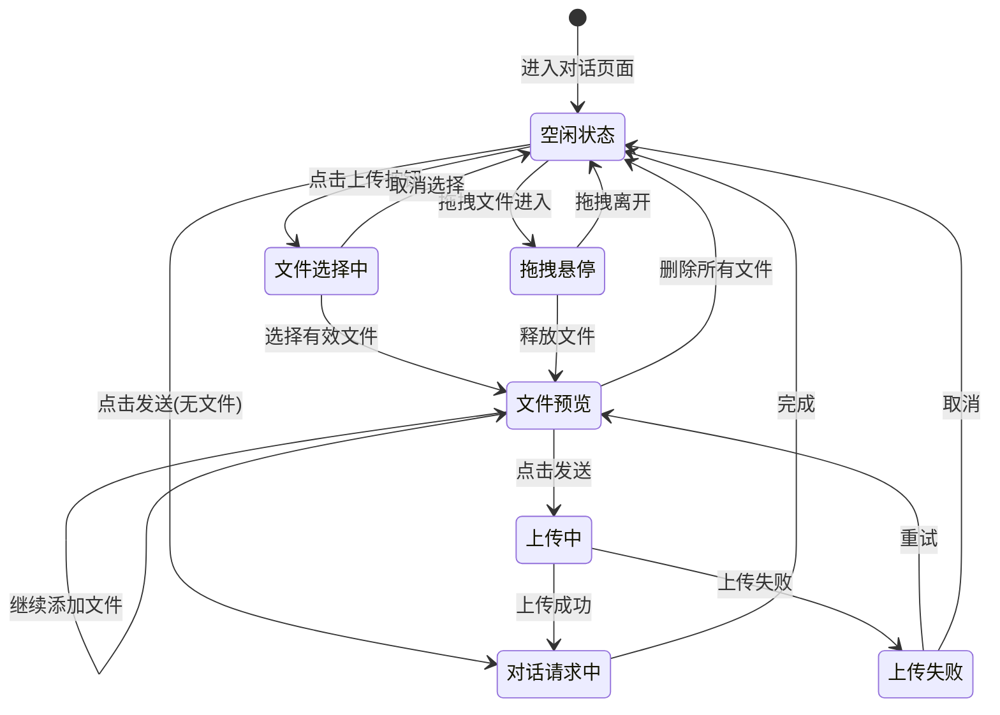

# UX 设计稿

## 文档信息

| 项目 | 内容 |
|------|------|
| 迭代号 | iteration-2603111255 |
| 版本 | v1.0 |
| 日期 | 2026-03-11 |
| 设计师 | TF141-UX |

---

## 1. 用户旅程设计

### 1.1 核心用户流程

```
┌─────────────────────────────────────────────────────────────────────────────┐
│                           文件上传完整用户旅程                                │
└─────────────────────────────────────────────────────────────────────────────┘

用户进入调试对话页面
        │
        ▼
┌───────────────────┐
│  Step 1: 发现入口  │
│                   │
│  用户注意到输入框  │
│  左侧的回形针图标  │
└────────┬──────────┘
         │
         ▼
┌───────────────────────────────────────────────────────────────────┐
│  Step 2: 选择文件                                                 │
│                                                                   │
│  方式A: 点击回形针 → 系统文件选择器打开 → 选择文件                  │
│  方式B: 从文件管理器拖拽 → 拖到输入区域 → 释放                     │
└───────────────────────────────────────────────────────────────────┘
         │
         ▼
┌───────────────────────────────────────────────────────────────────┐
│  Step 3: 预览确认                                                 │
│                                                                   │
│  ┌─────────────────────────────────────────────────────────────┐ │
│  │ 📎 待发送文件 (2)                      [+ 添加更多]          │ │
│  ├─────────────────────────────────────────────────────────────┤ │
│  │  ┌──────┐   ┌──────┐                                       │ │
│  │  │ 📄   │   │ 📊   │                                       │ │
│  │  │report│   │data  │                                       │ │
│  │  │.pdf  │   │.xlsx │                                       │ │
│  │  │2.3MB │   │156KB │                                       │ │
│  │  └──────┘   └──────┘                                       │ │
│  └─────────────────────────────────────────────────────────────┘ │
│                                                                   │
│  用户可以:                                                        │
│  - 查看已选文件列表                                               │
│  - 删除不需要的文件（悬停显示删除按钮）                             │
│  - 继续添加更多文件                                               │
└───────────────────────────────────────────────────────────────────┘
         │
         ▼
┌───────────────────────────────────────────────────────────────────┐
│  Step 4: 发送消息                                                 │
│                                                                   │
│  用户输入消息文本（可选，也支持仅发送文件）                         │
│  点击「发送」按钮                                                 │
└───────────────────────────────────────────────────────────────────┘
         │
         ▼
┌───────────────────────────────────────────────────────────────────┐
│  Step 5: 上传处理                                                 │
│                                                                   │
│  系统自动上传文件到后端                                           │
│  - 显示上传进度（可选，小文件快速上传可能不需要）                   │
│  - 上传成功后开始发送对话请求                                     │
│  - 上传失败显示错误提示                                           │
└───────────────────────────────────────────────────────────────────┘
         │
         ▼
┌───────────────────────────────────────────────────────────────────┐
│  Step 6: 对话展示                                                 │
│                                                                   │
│  用户消息气泡中显示文件附件                                        │
│  ┌────────────────────────────────────────────┐                  │
│  │ 请帮我分析这个PDF文件                        │                  │
│  │ ────────────────────────────────────────   │                  │
│  │ 📄 report.pdf  2.3MB                       │                  │
│  │ 📊 data.xlsx   156KB                       │                  │
│  └────────────────────────────────────────────┘                  │
└───────────────────────────────────────────────────────────────────┘
```

### 1.2 用户旅程状态图



---

## 2. 交互流程设计

### 2.1 文件选择交互

#### 2.1.1 点击上传

```
┌─────────────────────────────────────────────────────────────┐
│ 点击上传交互流程                                             │
├─────────────────────────────────────────────────────────────┤
│                                                             │
│  [📎] ──点击──> 打开系统文件选择器                           │
│                   │                                         │
│                   ▼                                         │
│            ┌─────────────────┐                              │
│            │ 选择文件对话框   │                              │
│            │                 │                              │
│            │ ☑ report.pdf    │                              │
│            │ ☑ data.xlsx     │                              │
│            │ ☐ notes.txt     │                              │
│            │                 │                              │
│            │ [取消] [打开]   │                              │
│            └────────┬────────┘                              │
│                     │                                       │
│           ┌─────────┴─────────┐                             │
│           ▼                   ▼                             │
│      点击「打开」         点击「取消」                        │
│           │                   │                             │
│           ▼                   ▼                             │
│    验证文件类型/大小      返回空闲状态                        │
│           │                                                 │
│     ┌─────┴─────┐                                           │
│     ▼           ▼                                           │
│  验证通过    验证失败                                         │
│     │           │                                           │
│     ▼           ▼                                           │
│  添加到预览  显示错误提示                                     │
│                                                             │
└─────────────────────────────────────────────────────────────┘
```

#### 2.1.2 拖拽上传

```
┌─────────────────────────────────────────────────────────────┐
│ 拖拽上传交互流程                                             │
├─────────────────────────────────────────────────────────────┤
│                                                             │
│  拖拽文件进入输入区域                                        │
│         │                                                   │
│         ▼                                                   │
│  ┌───────────────────────────────────────┐                  │
│  │                                       │                  │
│  │     ╭─────────────────────────────╮   │                  │
│  │     │                             │   │                  │
│  │     │    📂 拖放文件到此处上传     │   │  ← 蓝色虚线边框  │
│  │     │                             │   │                  │
│  │     ╰─────────────────────────────╯   │                  │
│  │                                       │                  │
│  └───────────────────────────────────────┘                  │
│         │                                                   │
│         ▼                                                   │
│  释放文件                                                   │
│         │                                                   │
│         ▼                                                   │
│  验证文件 → 添加到预览列表                                   │
│                                                             │
└─────────────────────────────────────────────────────────────┘
```

### 2.2 文件预览交互

#### 2.2.1 文件卡片状态

| 状态 | 视觉表现 | 交互 |
|------|----------|------|
| **默认** | 半透明白色背景，文件图标+名称+大小 | 无 |
| **悬停** | 背景变亮，显示删除按钮(×) | 删除按钮可点击 |
| **删除中** | - | 点击删除按钮移除文件 |
| **禁用** | 整体降低透明度(50%) | 所有交互禁用 |

#### 2.2.2 文件预览区交互细节

```
┌─────────────────────────────────────────────────────────────────────┐
│ 文件预览区交互规范                                                   │
├─────────────────────────────────────────────────────────────────────┤
│                                                                     │
│  ┌─────────────────────────────────────────────────────────────┐   │
│  │ 📎 待发送文件 (3)                        [+ 添加更多]        │   │
│  ├─────────────────────────────────────────────────────────────┤   │
│  │                                                             │   │
│  │   ┌────────┐   ┌────────┐   ┌────────┐                      │   │
│  │   │  ╳     │   │        │   │        │   ← 悬停时显示删除   │   │
│  │   │  📄    │   │  📊    │   │  📝    │                      │   │
│  │   │ report │   │  data  │   │ notes  │                      │   │
│  │   │ .pdf   │   │ .xlsx  │   │ .txt   │                      │   │
│  │   │ 2.3MB  │   │ 156KB  │   │ 12KB   │                      │   │
│  │   └────────┘   └────────┘   └────────┘                      │   │
│  │       ▲                                                     │   │
│  │       │                                                     │   │
│  │   可水平滚动，超出容器宽度的文件可滚动查看                     │   │
│  │                                                             │   │
│  └─────────────────────────────────────────────────────────────┘   │
│                                                                     │
│  交互说明：                                                         │
│  1. 文件卡片宽度固定 64px，高度 80px                                │
│  2. 文件名超过 8 个字符截断显示 "report..."                         │
│  3. 悬停显示删除按钮，点击立即移除                                   │
│  4. 支持水平滚动查看更多文件                                        │
│  5. "添加更多" 按钮再次打开文件选择器                               │
│                                                                     │
└─────────────────────────────────────────────────────────────────────┘
```

### 2.3 上传状态反馈

#### 2.3.1 上传进度反馈

由于单文件最大 100MB，上传可能需要时间，设计以下反馈机制：

```
┌─────────────────────────────────────────────────────────────┐
│ 上传状态反馈                                                 │
├─────────────────────────────────────────────────────────────┤
│                                                             │
│  场景A: 小文件快速上传（< 1MB）                              │
│  ─────────────────────────────────────────────────────────  │
│  直接上传，无需显示进度条                                    │
│  上传成功后直接进入对话请求                                  │
│                                                             │
│                                                             │
│  场景B: 大文件上传（> 1MB）                                  │
│  ─────────────────────────────────────────────────────────  │
│                                                             │
│  ┌─────────────────────────────────────────────────────┐   │
│  │ 📤 正在上传文件...                                   │   │
│  │ ████████████░░░░░░░░░░░░░░░░░░░░░░░░░░░░  45%        │   │
│  │ report.pdf (2.3MB)                                  │   │
│  └─────────────────────────────────────────────────────┘   │
│                                                             │
│                                                             │
│  场景C: 上传失败                                            │
│  ─────────────────────────────────────────────────────────  │
│                                                             │
│  ┌─────────────────────────────────────────────────────┐   │
│  │ ⚠️ 文件上传失败                                      │   │
│  │ 网络连接异常，请检查网络后重试                        │   │
│  │                                    [重试] [取消]     │   │
│  └─────────────────────────────────────────────────────┘   │
│                                                             │
└─────────────────────────────────────────────────────────────┘
```

#### 2.3.2 验证错误反馈

```
┌─────────────────────────────────────────────────────────────┐
│ 验证错误反馈样式                                             │
├─────────────────────────────────────────────────────────────┤
│                                                             │
│  错误类型1: 文件类型不支持                                   │
│  ┌─────────────────────────────────────────────────────┐   │
│  │ ⚠️ video.mp4: 不支持的文件类型                        │   │
│  │ 仅支持 PDF、DOCX、XLSX、TXT、CSV、JSON、图片文件       │   │
│  │                                                [×]   │   │
│  └─────────────────────────────────────────────────────┘   │
│                                                             │
│  错误类型2: 文件大小超限                                     │
│  ┌─────────────────────────────────────────────────────┐   │
│  │ ⚠️ large_file.pdf: 文件大小超过限制                   │   │
│  │ 最大文件大小: 100MB                                   │   │
│  │                                                [×]   │   │
│  └─────────────────────────────────────────────────────┘   │
│                                                             │
│  错误类型3: 文件数量超限                                     │
│  ┌─────────────────────────────────────────────────────┐   │
│  │ ⚠️ 单次最多上传 3 个文件                              │   │
│  │ 请分批上传                                            │   │
│  │                                                [×]   │   │
│  └─────────────────────────────────────────────────────┘   │
│                                                             │
│  样式规范:                                                   │
│  - 背景: bg-red-500/20 (红色 20% 透明度)                    │
│  - 边框: border-red-500/30                                  │
│  - 文字: text-red-400                                       │
│  - 图标: ⚠️ 黄色警告图标                                    │
│  - 关闭按钮: 右上角 × 按钮，点击关闭                        │
│                                                             │
└─────────────────────────────────────────────────────────────┘
```

### 2.4 与对话的关联

#### 2.4.1 消息气泡中的文件展示

```
┌─────────────────────────────────────────────────────────────┐
│ 用户消息气泡 - 含文件附件                                    │
├─────────────────────────────────────────────────────────────┤
│                                                             │
│                           ┌────────────────────────────┐    │
│                           │ 请帮我分析这个PDF文件的内容 │    │
│                           │ ──────────────────────────│    │
│                           │ 📄 report.pdf      2.3MB  │    │
│                           │ 📊 data.xlsx       156KB  │    │
│                           └────────────────────────────┘    │
│                                     ▲                       │
│                                     │                       │
│                              蓝色气泡，右对齐                │
│                                                             │
│  样式规范:                                                   │
│  - 气泡背景: bg-blue-500                                    │
│  - 文件区域分隔线: border-white/20                          │
│  - 文件图标: 根据类型着色 (PDF红, Excel绿, Word蓝)          │
│  - 文件大小: text-white/60                                  │
│                                                             │
└─────────────────────────────────────────────────────────────┘
```

#### 2.4.2 对话请求中的文件传递

```
┌─────────────────────────────────────────────────────────────┐
│ 文件与对话的数据流                                           │
├─────────────────────────────────────────────────────────────┤
│                                                             │
│  用户点击发送                                                │
│       │                                                     │
│       ▼                                                     │
│  ┌─────────────────────────────────────────┐               │
│  │ 1. 先上传文件到后端                      │               │
│  │    POST /api/agents/{name}/files        │               │
│  │    → 返回 file_id 列表                  │               │
│  └─────────────────────────────────────────┘               │
│       │                                                     │
│       ▼                                                     │
│  ┌─────────────────────────────────────────┐               │
│  │ 2. 发送对话请求                          │               │
│  │    POST /stream/agents/{name}/chat      │               │
│  │    Body: {                              │               │
│  │      message: "...",                    │               │
│  │      history: [...],                    │               │
│  │      file_ids: ["abc123", "def456"]     │               │
│  │    }                                    │               │
│  └─────────────────────────────────────────┘               │
│       │                                                     │
│       ▼                                                     │
│  ┌─────────────────────────────────────────┐               │
│  │ 3. 后端处理                              │               │
│  │    - 将文件路径注入 system_prompt        │               │
│  │    - LLM 可调用 execute_skill 工具       │               │
│  │    - 脚本通过 input_file_ids 访问文件    │               │
│  └─────────────────────────────────────────┘               │
│                                                             │
└─────────────────────────────────────────────────────────────┘
```

---

## 3. 视觉规范

### 3.1 颜色系统

```
┌─────────────────────────────────────────────────────────────────────┐
│ 文件上传功能颜色规范                                                 │
├─────────────────────────────────────────────────────────────────────┤
│                                                                     │
│  主色调                                                              │
│  ─────────────────────────────────────────────────────────────────  │
│  │ 蓝色 (主交互色)     │ bg-blue-500    │ #3b82f6  │ ■■■         │  │
│  │ 蓝色 (悬停)         │ hover:bg-blue-600 │ #2563eb │ ■■■       │  │
│  │ 蓝色 (透明背景)     │ bg-blue-400/10 │ rgba(96,165,250,0.1) │  │
│  └─────────────────────────────────────────────────────────────────┘
│                                                                     │
│  文件类型颜色                                                        │
│  ─────────────────────────────────────────────────────────────────  │
│  │ PDF 文档           │ text-red-400    │ #f87171  │ ■■■         │  │
│  │ Word 文档          │ text-blue-400   │ #60a5fa  │ ■■■         │  │
│  │ Excel 表格         │ text-green-400  │ #4ade80  │ ■■■         │  │
│  │ 图片文件           │ text-purple-400 │ #c084fc  │ ■■■         │  │
│  │ 通用文件           │ text-gray-400   │ #9ca3af  │ ■■■         │  │
│  └─────────────────────────────────────────────────────────────────┘
│                                                                     │
│  状态颜色                                                            │
│  ─────────────────────────────────────────────────────────────────  │
│  │ 成功/确认          │ text-green-400  │ #4ade80  │ ■■■         │  │
│  │ 警告/注意          │ text-yellow-400 │ #facc15  │ ■■■         │  │
│  │ 错误/失败          │ text-red-400    │ #f87171  │ ■■■         │  │
│  │ 禁用/不可用        │ opacity-50      │ 50% 透明  │ ■■■         │  │
│  └─────────────────────────────────────────────────────────────────┘
│                                                                     │
│  背景色                                                              │
│  ─────────────────────────────────────────────────────────────────  │
│  │ 预览区背景         │ bg-white/5      │ rgba(255,255,255,0.05)  │  │
│  │ 卡片背景           │ bg-white/5      │ rgba(255,255,255,0.05)  │  │
│  │ 卡片悬停背景       │ bg-white/10     │ rgba(255,255,255,0.1)   │  │
│  │ 拖拽激活背景       │ bg-blue-400/10  │ rgba(96,165,250,0.1)    │  │
│  │ 错误背景           │ bg-red-500/20   │ rgba(239,68,68,0.2)     │  │
│  └─────────────────────────────────────────────────────────────────┘
│                                                                     │
│  边框色                                                              │
│  ─────────────────────────────────────────────────────────────────  │
│  │ 默认边框           │ border-white/10 │ rgba(255,255,255,0.1)   │  │
│  │ 拖拽边框           │ border-blue-400 │ #60a5fa                 │  │
│  │ 错误边框           │ border-red-500/30 │ rgba(239,68,68,0.3)   │  │
│  └─────────────────────────────────────────────────────────────────┘
│                                                                     │
└─────────────────────────────────────────────────────────────────────┘
```

### 3.2 按钮样式

#### 3.2.1 上传按钮

```css
/* 上传按钮 - 默认状态 */
.upload-button {
  padding: 0.5rem;           /* p-2 */
  border-radius: 0.5rem;     /* rounded-lg */
  color: #9ca3af;            /* text-gray-400 */
  transition: color 150ms;   /* transition-colors */
}

/* 上传按钮 - 悬停状态 */
.upload-button:hover {
  color: #60a5fa;            /* hover:text-blue-400 */
}

/* 上传按钮 - 有文件时 */
.upload-button.has-files {
  color: #60a5fa;            /* text-blue-400 */
}

/* 上传按钮 - 禁用状态 */
.upload-button:disabled {
  opacity: 0.5;              /* opacity-50 */
  cursor: not-allowed;       /* cursor-not-allowed */
}
```

#### 3.2.2 删除按钮

```css
/* 删除按钮 - 位于文件卡片右上角 */
.delete-button {
  position: absolute;
  top: -4px;                 /* -top-1 */
  right: -4px;               /* -right-1 */
  width: 16px;               /* w-4 */
  height: 16px;              /* h-4 */
  border-radius: 50%;        /* rounded-full */
  background: rgba(239, 68, 68, 0.8);  /* bg-red-500/80 */
  color: white;
  display: flex;
  align-items: center;
  justify-content: center;
  opacity: 0;                /* 默认隐藏 */
  transition: all 150ms;
}

/* 悬停时显示 */
.file-card:hover .delete-button {
  opacity: 1;
}

/* 删除按钮悬停 */
.delete-button:hover {
  background: #ef4444;       /* hover:bg-red-500 */
}
```

### 3.3 文件图标规范

```
┌─────────────────────────────────────────────────────────────────────┐
│ 文件图标规范                                                         │
├─────────────────────────────────────────────────────────────────────┤
│                                                                     │
│  图标来源: lucide-react                                              │
│                                                                     │
│  ┌─────────────────────────────────────────────────────────────┐   │
│  │ 文件类型      │ 图标组件           │ 颜色类        │ 尺寸    │   │
│  ├─────────────────────────────────────────────────────────────┤   │
│  │ PDF          │ FileText           │ text-red-400  │ w-8 h-8 │   │
│  │ DOC/DOCX     │ FileText           │ text-blue-400 │ w-8 h-8 │   │
│  │ XLS/XLSX     │ FileSpreadsheet    │ text-green-400│ w-8 h-8 │   │
│  │ PNG/JPG/JPEG │ Image              │ text-purple-400│w-8 h-8 │   │
│  │ TXT/CSV/JSON │ File               │ text-gray-400 │ w-8 h-8 │   │
│  │ 其他         │ File               │ text-gray-400 │ w-8 h-8 │   │
│  └─────────────────────────────────────────────────────────────┘   │
│                                                                     │
│  图标映射逻辑:                                                       │
│  ```typescript                                                       │
│  function getFileIcon(mimeType: string) {                           │
│    if (mimeType === 'application/pdf')                              │
│      return <FileText className="w-8 h-8 text-red-400" />;          │
│    if (mimeType.includes('word') || mimeType.includes('document'))  │
│      return <FileText className="w-8 h-8 text-blue-400" />;         │
│    if (mimeType.includes('spreadsheet') || mimeType.includes('excel'))│
│      return <FileSpreadsheet className="w-8 h-8 text-green-400" />; │
│    if (mimeType.startsWith('image/'))                               │
│      return <Image className="w-8 h-8 text-purple-400" />;          │
│    return <File className="w-8 h-8 text-gray-400" />;               │
│  }                                                                   │
│  ```                                                                 │
│                                                                     │
└─────────────────────────────────────────────────────────────────────┘
```

### 3.4 状态指示

#### 3.4.1 文件预览区状态指示

| 状态 | 视觉表现 |
|------|----------|
| **空** | 不显示预览区 |
| **有待发送文件** | 显示预览区，标题显示文件数量 |
| **上传中** | 显示上传进度条 |
| **上传成功** | 预览区消失，进入对话流程 |
| **上传失败** | 显示错误提示框 |

#### 3.4.2 发送按钮状态

| 状态 | 视觉表现 | 是否可点击 |
|------|----------|------------|
| **无消息无文件** | 蓝色背景，低透明度 | 不可点击 |
| **有消息或有文件** | 蓝色背景，正常 | 可点击 |
| **上传/对话中** | 蓝色背景，低透明度 | 不可点击 |

---

## 4. 组件规范

### 4.1 文件预览卡片组件

```typescript
interface FilePreviewCardProps {
  file: PendingFile;
  onRemove: (fileId: string) => void;
  locale?: 'zh' | 'en';
}

// 尺寸规范
const CARD_WIDTH = 64;    // w-16
const CARD_HEIGHT = 80;   // h-20
const ICON_SIZE = 32;     // w-8 h-8
const NAME_MAX_LENGTH = 8;
```

### 4.2 文件预览区组件

```typescript
interface FilePreviewAreaProps {
  files: PendingFile[];
  onAddMore: () => void;
  onRemove: (fileId: string) => void;
  disabled?: boolean;
  locale?: 'zh' | 'en';
}

// 功能规范
// - 标题显示文件数量
// - 水平滚动查看更多
// - "添加更多" 按钮触发文件选择
```

### 4.3 上传按钮组件

```typescript
interface UploadButtonProps {
  onClick: () => void;
  hasFiles?: boolean;
  disabled?: boolean;
  title?: string;
}

// 样式变体
// - 无文件: text-gray-400
// - 有文件: text-blue-400
// - 禁用: opacity-50
```

### 4.4 文件输入组件

```typescript
interface FileInputProps {
  ref: React.RefObject<HTMLInputElement>;
  accept: string[];        // 允许的 MIME 类型
  multiple: boolean;       // 是否允许多选
  disabled: boolean;
  onChange: (e: ChangeEvent<HTMLInputElement>) => void;
}

// accept 属性示例
// "application/pdf,.docx,.xlsx,.txt,.csv,.json,.png,.jpg,.jpeg"
```

---

## 5. 响应式设计

### 5.1 断点适配

```
┌─────────────────────────────────────────────────────────────────────┐
│ 响应式断点                                                           │
├─────────────────────────────────────────────────────────────────────┤
│                                                                     │
│  断点名称    │ 最小宽度  │ 布局变化                                  │
│  ─────────────────────────────────────────────────────────────────  │
│  sm         │ 640px    │ - 输入框宽度自适应                         │
│  md         │ 768px    │ - 文件预览区最大宽度 100%                  │
│  lg         │ 1024px   │ - 标准桌面布局                             │
│  xl         │ 1280px   │ - 大屏幕优化                               │
│                                                                     │
│  调试对话区域是固定宽度的侧边栏，不需要复杂的响应式处理              │
│  主要考虑:                                                           │
│  1. 文件预览区水平滚动始终可用                                       │
│  2. 输入框宽度自动填充剩余空间                                       │
│  3. 文件卡片尺寸固定，不随屏幕变化                                   │
│                                                                     │
└─────────────────────────────────────────────────────────────────────┘
```

---

## 6. 无障碍设计

### 6.1 键盘导航

| 快捷键 | 功能 |
|--------|------|
| `Tab` | 聚焦到上传按钮 |
| `Enter` | 打开文件选择器（聚焦在上传按钮时） |
| `Delete` | 删除当前聚焦的文件卡片 |

### 6.2 ARIA 属性

```html
<!-- 上传按钮 -->
<button
  type="button"
  aria-label="上传文件"
  aria-describedby="upload-hint"
>
  <Paperclip />
</button>

<!-- 文件预览区 -->
<div
  role="list"
  aria-label="待发送文件列表"
>
  <div role="listitem" aria-label="report.pdf, 2.3MB">
    <!-- 文件卡片 -->
  </div>
</div>

<!-- 删除按钮 -->
<button
  type="button"
  aria-label="移除文件 report.pdf"
>
  <X />
</button>
```

### 6.3 焦点管理

```
┌─────────────────────────────────────────────────────────────────────┐
│ 焦点顺序                                                             │
├─────────────────────────────────────────────────────────────────────┤
│                                                                     │
│  1. 上传按钮 [📎]                                                   │
│  2. 输入框 [________________]                                       │
│  3. 发送按钮 [发送]                                                 │
│                                                                     │
│  当文件预览区有文件时:                                               │
│  1. 上传按钮 [📎]                                                   │
│  2. 文件卡片 (可 Tab 切换)                                          │
│  3. 添加更多按钮                                                    │
│  4. 输入框 [________________]                                       │
│  5. 发送按钮 [发送]                                                 │
│                                                                     │
└─────────────────────────────────────────────────────────────────────┘
```

---

## 7. 国际化支持

### 7.1 文案对照表

| Key | 中文 | English |
|-----|------|---------|
| `uploadFile` | 上传文件 | Upload File |
| `pendingFiles` | 待发送文件 | Pending Files |
| `addMoreFiles` | 添加更多 | Add More |
| `dragDropHint` | 拖放文件到此处上传 | Drop files here to upload |
| `fileSizeExceeded` | 文件大小超过限制 | File size exceeds limit |
| `unsupportedFileType` | 不支持的文件类型 | Unsupported file type |
| `removeFile` | 移除文件 | Remove file |
| `maxFileSizeHint` | 最大文件大小 | Max file size |
| `supportedTypes` | 支持的文件类型 | Supported file types |

### 7.2 文件大小格式化

```typescript
function formatFileSize(bytes: number, locale: 'zh' | 'en'): string {
  if (bytes < 1024) return `${bytes} B`;
  if (bytes < 1024 * 1024) return `${(bytes / 1024).toFixed(1)} KB`;
  if (bytes < 1024 * 1024 * 1024) return `${(bytes / (1024 * 1024)).toFixed(1)} MB`;
  return `${(bytes / (1024 * 1024 * 1024)).toFixed(1)} GB`;
}
// 中英文使用相同格式，无需区分
```

---

## 8. 动效规范

### 8.1 过渡动画

```css
/* 基础过渡时间 */
--transition-fast: 150ms;    /* 快速交互：按钮悬停 */
--transition-normal: 200ms;  /* 常规交互：卡片显示/隐藏 */
--transition-slow: 300ms;    /* 慢速交互：面板展开 */

/* 文件卡片悬停 */
.file-card {
  transition: background-color 150ms ease;
}

/* 删除按钮显示 */
.delete-button {
  transition: opacity 150ms ease;
}

/* 拖拽区域高亮 */
.drop-zone {
  transition: background-color 200ms ease, border-color 200ms ease;
}
```

### 8.2 避免的动效

- 不要使用弹跳效果
- 不要使用旋转动画（除了加载指示器）
- 不要使用过度的缩放效果
- 文件列表更新不要有滑入动画，影响用户操作

---

## 9. 错误处理

### 9.1 错误类型与提示

| 错误类型 | 提示信息 | 解决方案 |
|----------|----------|----------|
| 文件类型不支持 | "{filename}: 不支持的文件类型" | 仅显示支持的文件类型 |
| 文件大小超限 | "{filename}: 文件大小超过限制 (最大 100MB)" | 压缩或分割文件 |
| 文件数量超限 | "单次最多上传 3 个文件" | 分批上传 |
| 网络错误 | "网络连接异常，请检查网络后重试" | 检查网络连接 |
| 服务器错误 | "上传失败，请稍后重试" | 稍后重试 |

### 9.2 错误提示展示

```
┌─────────────────────────────────────────────────────────────────────┐
│ 错误提示组件                                                         │
├─────────────────────────────────────────────────────────────────────┤
│                                                                     │
│  样式:                                                               │
│  - 背景: bg-red-500/20                                              │
│  - 边框: border border-red-500/30                                   │
│  - 圆角: rounded-lg                                                 │
│  - 内边距: p-2                                                      │
│  - 文字颜色: text-red-400                                           │
│  - 字体大小: text-xs                                                │
│                                                                     │
│  位置:                                                               │
│  - 位于文件预览区下方                                                │
│  - 多个错误换行显示                                                  │
│                                                                     │
│  行为:                                                               │
│  - 自动显示，5秒后自动消失                                           │
│  - 可点击 × 手动关闭                                                │
│  - 有新错误时追加显示                                                │
│                                                                     │
└─────────────────────────────────────────────────────────────────────┘
```

---

## 10. 设计决策记录

### 10.1 为什么选择回形针图标？

- 回形针是业界通用的"附件"符号
- 用户认知成本低
- 与邮件、聊天软件的附件按钮一致

### 10.2 为什么文件卡片悬停显示删除按钮？

- 默认隐藏可以保持界面简洁
- 悬停显示符合用户预期（类似 macOS Dock）
- 避免误操作（需要先悬停再点击）

### 10.3 为什么选择先上传再发送？

- 后端需要 file_id 来关联文件
- 上传失败时可以立即反馈，不影响对话
- 避免在对话过程中等待上传

### 10.4 为什么支持拖拽上传？

- 提升高级用户的效率
- 从文件管理器直接拖入比点击选择更快
- 符合现代 Web 应用的交互习惯

---

## 附录 A: 组件依赖关系

```
AgentChat (主组件)
    │
    ├── FileInput (隐藏的文件输入)
    │
    ├── UploadButton (上传按钮)
    │
    ├── FilePreviewArea (文件预览区)
    │   │
    │   ├── FilePreviewCard[] (文件卡片)
    │   │   ├── FileIcon (文件图标)
    │   │   └── DeleteButton (删除按钮)
    │   │
    │   └── AddMoreButton (添加更多按钮)
    │
    └── ErrorAlert (错误提示)
```

## 附录 B: API 调用流程

```
用户操作 → 前端处理 → API 调用 → 后端处理
    │           │           │           │
    │       验证文件     上传文件    存储文件
    │       类型/大小               生成 file_id
    │           │           │           │
    │       添加到预览   返回 file_id  返回响应
    │           │           │           │
    │       显示预览     保存 file_id
    │           │           │
    └───────────┴───────────┴───────────┘
                    │
                点击发送
                    │
                    ▼
            POST /stream/agents/{name}/chat
            Body: { message, history, file_ids }
```
